### Escuela Colombiana de Ingeniería

### Arquitecturas Empresariales

#### TALLER 4: TALLER DE ARQUITECTURAS DE SERVIDORES DE APLICACIONES, META PROTOCOLOS DE OBJETOS, PATRÓN IOC, REFLEXIÓN

#### Santiago Arévalo Rojas

### Instrucciones para ejecución

Para ejecutar la aplicación se deben seguir los siguientes pasos:
1. Se debe clonar el repositorio de github con el enlace dado en la entrega, el cual es: [https://github.com/santiarojas18/Lab4AREP.git](https://github.com/santiarojas18/Lab4AREP.git)
2. Una vez clonado se debe abrir el proyecto en el IDE de preferencia, en este caso se abrió en IntelliJ:  
    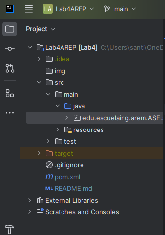    
3. Luego en el directorio src vamos a la clase MyWebServices que es la clase donde estamos ofreciendo los servicios, en la cual se tiene la función main:  
    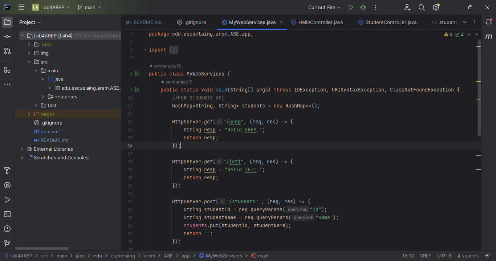  
4. Al ejecutar la aplicación desde el IDE evidenciamos que el servidor efectivamente está prendido y esperando por peticiones. Además, evidenciamos que muestra las clases que cargó, estas clases corresponden a las que tenían la etiqueta @Component, en este caso HelloController y StudentController:  
    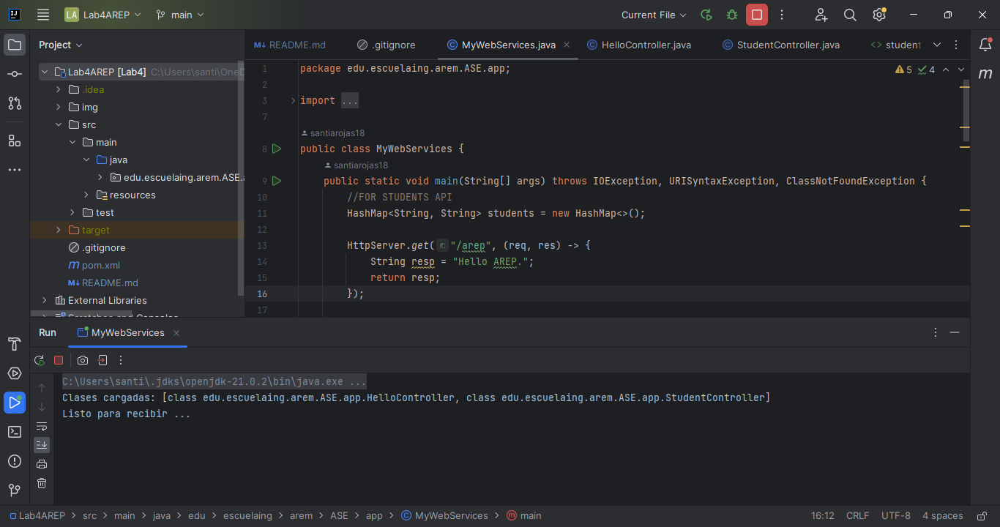  
5. Para probar el funcionamiento del framework se ofrecen 3 servicios GET distintos, a los que se pueden acceder con la URL [http://localhost:35000/hello](http://localhost:35000/hello), [http://localhost:35000/goodbye](http://localhost:35000/goodbye), además de una API para consultar los estudiantes de una institución, [http://localhost:35000/students](http://localhost:35000/students), el funcionamiento se ve algo así:  
    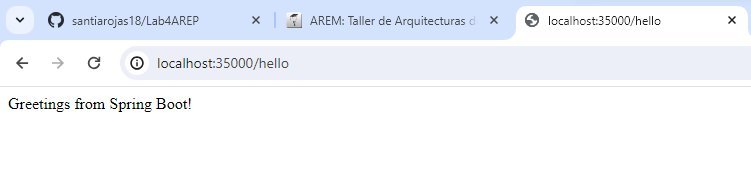  
    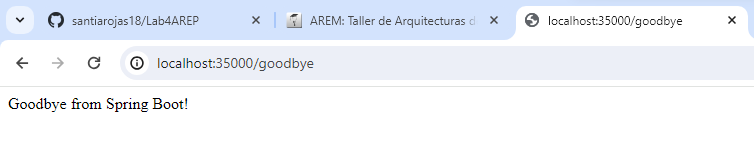  
    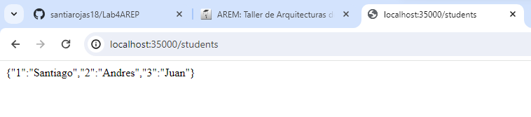  
6. Se hizo una pequeña página web para consultar a los estudiantes de manera gráfica, la cual hace peticiones al API y se accede por la URL [http://localhost:35000/studentsAnnotations.html](http://localhost:35000/studentsAnnotations.html):  
    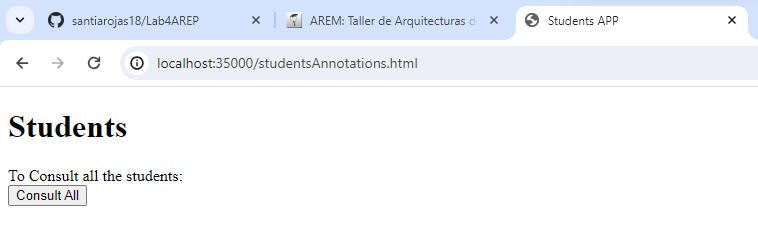   
7. Al darle click al botón de Consult All vemos todos los estudiantes:  
    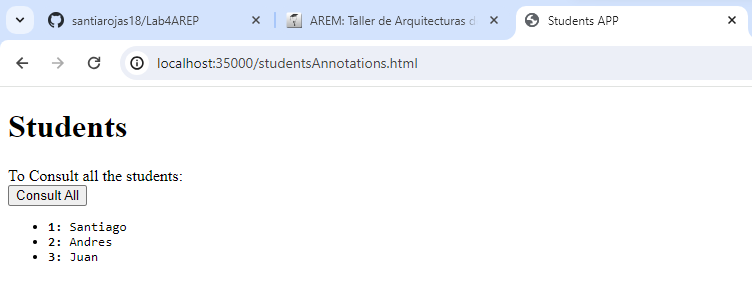  
8. Para un usuario del framework, es sencillo exponer los servicios y se hace al mismo estilo del framework Springboot, en la imagen podemos observar que basta con poner las anotaciones necesarios para realizarlo:  
    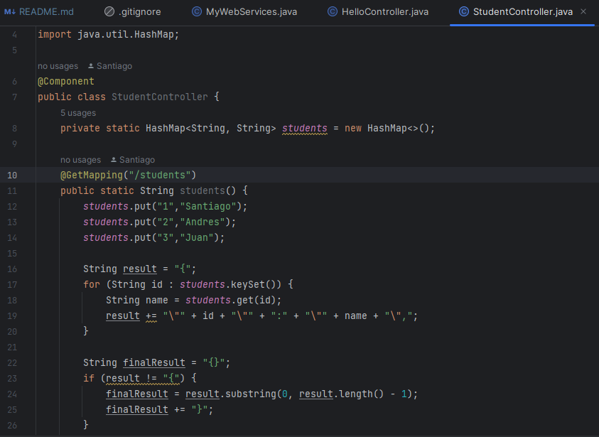  

### Información del diseño

* Primero se crearon dos anotaciones, la primera es Component que es la que se le debe asignar a las clases para saber que va a ser un componente para cargar, para que fuera de clase, se le agregó el @Target de tipo TYPE:  
    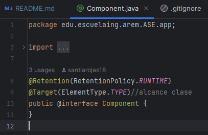  
* Luego para manejar los métodos se creó la anotación GetMapping, que representa un método que responde peticiones GET, al ser un método, el @Target es de tipo Method, además, debe tener un atributo que se llama value, este se utiliza para que el usuario del framework pueda indicar específicamente a que path responderá:  
    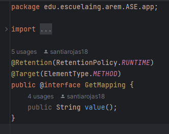  
* Con el fin de cargar las clases sin que se deba indicar una por una, se realizaron dos métodos, que son llamados tan pronto se corre el servidor, el primero es el método loadingClasses, que recibe de parámetros el paquete raíz y la anotación que se desea cargar, y así se ve la invocación del método, donde estamos buscando los que tengan la anotación @Component:  
    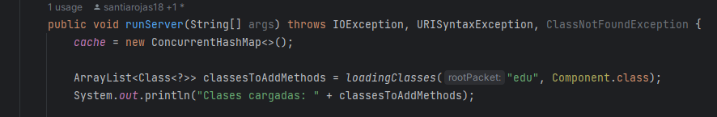  
* Al ver este método, encontramos que busca los paquetes y luego busca las clases con el método findingClassInDirectory que se encarga de ver si la clase tiene la anotación que estamos buscando, si la tiene entonces la agrega al ArrayList:  
    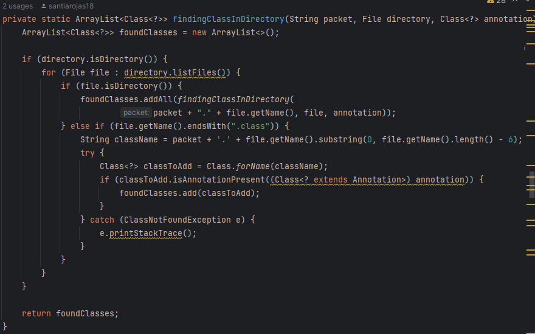  
* Una vez encontradas las clases que se van a cargar, por cada una de estas se les busca los métodos que se van a cargar, los cuales son los que tienen la anotación @GetMapping:  
    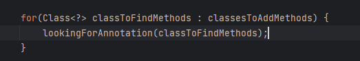  
* Finalmente, este método es el encargado de guardar los métodos en el HashMap de servicios, en donde a la clase que le envían le consulta sus métodos y si tiene la anotación antes dicha, los agrega al HashMap, siendo la llave el path al que responde cada método:  
    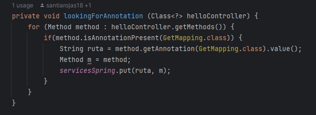  
* Al llegar una petición al servidor, cuyo path se encuentre en el conjunto de llaves del HashMap, se procede a invocar el método y retornar la respuesta con un código 200 de éxito:  
    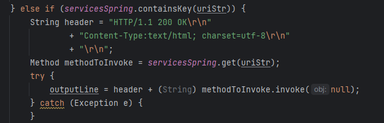  

### Pruebas y Evaluación

Para validar el funcionamiento se realizaron de nuevo peticiones a la API y externa y además peticiones de archivos al servidor para confirmar que se estuvieran respondiendo de manera adecuada. Para su ejecución basta con dirigirse a src/test/ y ejecutar la clase AppTest. Además de pruebas de funcionamiento como se ven en el apartado de instrucciones para ejecución.
   